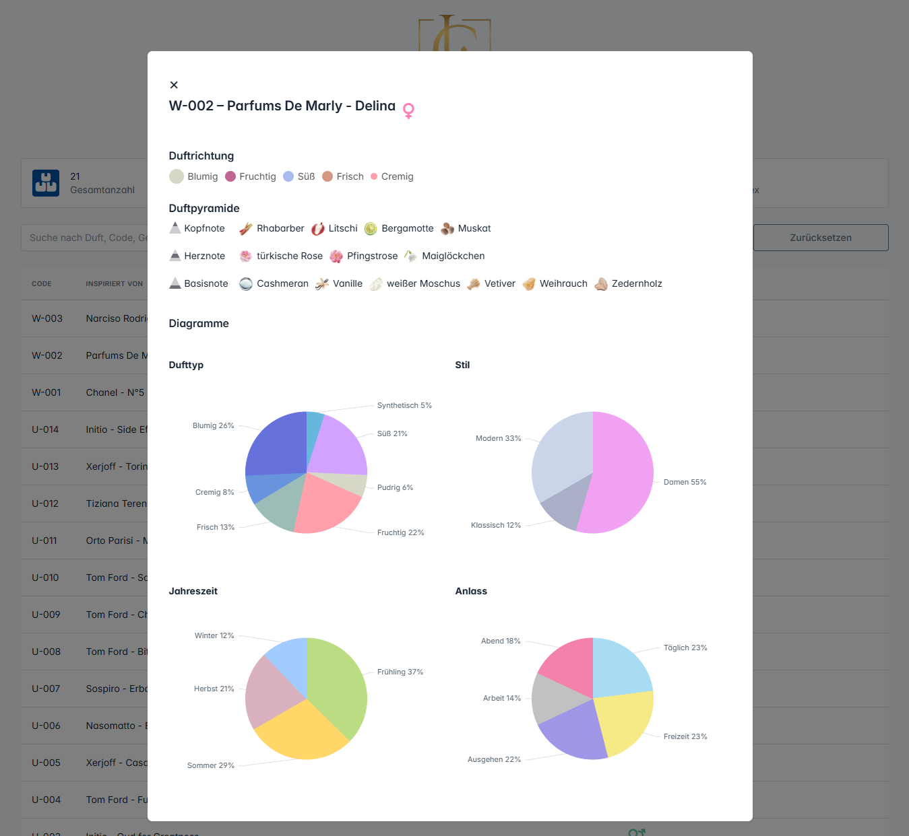

# Fragrance Manager

Ein webbasiertes Verwaltungssystem für Parfums mit QR-Code-Unterstützung, Duftnoten-Diagramm, Kundenansicht und Admin-Dashboard – inklusive Installer.



---

# 🚀 Features


- ✅ Düfte verwalten – mit Duftnoten (Kopf, Herz, Basis), Typ, Saison, Anlass usw.

- ✅ Duftpyramide mit Diagramm – für strukturierte Duftdarstellung

- ✅ QR-Code-Integration – direkter Aufruf der Duftdetailseite per Scan

- ✅ Installer mit SQL-Import – kein manuelles Setup nötig

- ✅ Admin-Dashboard – zur Bearbeitung und Verwaltung aller Inhalte

- ✅ Mehrsprachigkeit – Sprache wählbar über Admin-Panel

- ✅ Konfigurierbare Einstellungen – Titel, Beschreibung, Logo, SMTP, uvm.

- ✅ E-Mail-Funktion (z. B. bei Defektmeldungen)

---

# 🛠️ Technologien

- PHP (PDO)

- MySQL

- Bootstrap 5

- JavaScript, TomSelect.js, fslightbox.js

- PHPMailer

- QR-Code Generator

- Eigener Installer (Multi-Step)

---

# ⚙️ Installation


1. Projekt herunterladen oder klonen:

```markdown  
git clone https://github.com/s0n11c39/fragrance-manager.git  
```

2. In einen Webserver-Ordner legen (`htdocs/parfum` bei XAMPP o. ä.)

3. Im Browser aufrufen:

```bash  
http://localhost/parfum/install/  
```  
4. Den grafischen Installer ausführen:

- Systemvoraussetzungen werden geprüft

- MySQL-Datenbankverbindung eintragen

- SQL-Import erfolgt automatisch

- Website-Einstellungen & Admin-Benutzer anlegen

5. Danach
```bash  
http://localhost/parfum/
```  

---

# ✅ ToDo / Roadmap

- ✅  Installer mit SQL-Import
- ✅  Admin-Panel
- ✅  Rollenbasierte Benutzerverwaltung
- 🟡  Sprachdateien 
- ⏳  API-Anbindung für externe Tools (scrapper o.ä)
- ⏳  Logging & Analytics im Dashboard


🟡 in Arbeit | 🔄 in Überarbeitung | 🧪 in Testphase | ⚠️ bekanntes Problem | ⏳ geplant | ⬜️ Noch offen | ✅ Erledigt

---

# 📝 Lizenz

Dieses Projekt steht unter der MIT License – siehe LICENSE.

---

# 🙋‍♂️ Autor

Dominik

🔗 https://github.com/s0n11c39

---

# 💡 Hinweis

Dieses Projekt wurde für die Duftbranche entwickelt, eignet sich aber auch als Basis für ähnliche Produktkataloge mit Admin-Verwaltung und Kundenansicht. Besonders geeignet für Webentwickler, Agenturen oder kleine Unternehmen mit Fokus auf Parfüm, Kosmetik oder Produktmanagement.

---

